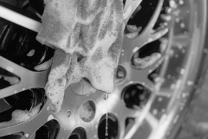

<?xml version="1.0" encoding="UTF-8"?>
<!DOCTYPE html>
<html xmlns="http://www.w3.org/1999/xhtml" xml:lang="en" lang="en">
<head>
<title>TAG mobile detailing</title>
<link rel="apple-touch-icon" sizes="180x180" href="/apple-touch-icon.png">
<link rel="icon" type="image/png" sizes="32x32" href="/favicon-32x32.png">
<link rel="icon" type="image/png" sizes="16x16" href="/favicon-16x16.png">
<link rel="manifest" href="/site.webmanifest">
<link rel="stylesheet" href="https://maxcdn.bootstrapcdn.com/bootstrap/4.3.1/css/bootstrap.min.css">

<link href='https://fonts.googleapis.com/css?family=Carme' rel='stylesheet'>

</head>
<body>
<!--nav collapse bar-->
  <nav class="navbar navbar-expand-md bg-primary navbar-dark">
    <a class="navbar-brand" href="#">T.A.G.</a>
      <button class="navbar-toggler" type="button" data-toggle="collapse" data-target="#collapsibleNavbar">
        
      </button>
      

        <ul class="navbar-nav">
          <li class="nav-item">
            <a class="nav-link" href="#about.html">About</a>
          </li>
          <li class="nav-item">
            <a class="nav-link" href="#gallery.html">Gallery/Testimonials</a>
          </li>
          <li class="nav-item">
            <a class="nav-link" href="#">Call Us</a>
          </li>      
        </ul>
      
  
    </nav>
<!--end nav bar-->

<!--about/mission-->

      

        

          
 &nbsp; 

          
 &nbsp; 

          <h2>Our Mission</h2>
          
Team Auto Grooming is a veteran owned and family operated mobile detailing business serving the
            greater Houston area. We're a two man team to double check each other's work so we may gaurentee the highest quality clean 
            every time. Experience the luxury of having us come to you!
          

        

  <!--IMAGE-->
        

        

        
  
      

    
  
    
 &nbsp; 

    
 &nbsp; 

<!--(service bronze) (about us)-->

      
  
        

          <h2>Bronze</h2>
          
clean exterior foam pressure wash hand wash

          
tire and rim clean and polish 

          
window and door jam wipe down

          
vacuum and interior dressing
 
          
car  &nbsp; $30

          
truck/suv  &nbsp; $40

        
    
  <!--(service silver) -->  
        

          <h2>Silver</h2>
          
bronze package included

          
intensive door panel steaming and cleaning touch parts included (steering wheel center console arm rest)

          
vrp exterior and  interior trim

          
CG spray wax and CG scent of your choice

          
degrease and intesive cleaning to wheel wells and undercarriage
 
          
car  &nbsp; $100

          
truck/suv  &nbsp; $125

        
    
  <!--gold serv-->
        

          <h2>Gold</h2>
          
silver package included

          
interior seat and carpet shampoo (leather seats are steamed, cleaned and conditioned)

          
ozone cleaner air sanitzer (sterilizes all smells and odors with concentrted O3)

          
full body Clay bar with buff wax
 
          
car  &nbsp; $300

          
midsize/crossover  &nbsp; $325

          
truck/suv  &nbsp; $350

        

      
    
    

    
 &nbsp; 

    
 &nbsp; 

    <!--footer and socials-->
      

        
 &nbsp; 

          <a class="col-6 text-white" style="text-decoration: none;" href="text-white" href="https://www.facebook.com/">Facebook</a>
          <a class="col-6 text-white" style="float: right; text-decoration: none;" href="">Messenger</a>
        
 &nbsp; 
  
      

</body>
</html>
